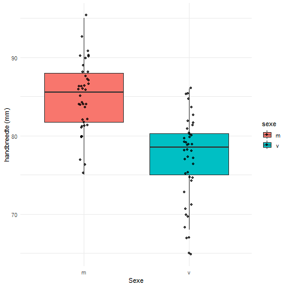

# Onderzoek Biometrie handen meting

In Dit onderzoek hebben we 40 mensen hun handen gemeten, 20 mannen en 20 vrouwen. 

## Projectomschrijving

Voor dit onderzoek hebben wij van 40 personen, 20 mannen en 20 vrouwen, zowel de lengte als de breedte van de hand gemeten om te kijken of er gemiddeld een verschil zit tussen de grootte van de hand tussen man en vrouw.

## Resultaten

|     | m |v|
| -------- | ------- |-------|
| Handlengte  |198.025000|181.100000|
| spreiding_lengte |16.460501|10.468022|
| handbreedte| 84.900000|77.475000|
|spreiding_breedte|4.465250|5.153975|
|ratio|2.335311|2.344873|

Hierboven is een kleine tabel te zien met de gemiddeldes en spreidingen van de metingen. De data is opgedeeld in 2 categorieën, man en vrouw. Aan de hand van deze tabel alleen al kan je zien dat de hand van een man gemiddeld groter is dan die van een vrouw, maar toch gaan we dit op andere manieren bekijken.

### Plot voor handlengte tussen de sexe

### Plot voor handbreedte tussen de sexe

### Histogram Ratio tussen de sexe

In de 3 grafieken hierboven zie je de data uit de tabel. Alle grafieken zijn gesplitst op sexe. De bovenste boxplot laat de verdeling van de handbreedte tussen de sexe zien. De boxplot daaronder laat de verdeling van de handlengte tussen de sexe zien. De histogram laat de verdeling van de ratio tussen de sexe zien. Wat opvalt is dat er in elke grafiek wel minstens een uitschieter zit. 

## Conclusie
Uit de resultaten van de metingen kunnen wij concluderen dat er een verschill zit in de grootte van de hand tussen mannen en vrouwen. De mannelijke hand is gemiddeld groter dan de vrouwelijke hand. De ratio tussen mannen en vrouwen is echter hetzelfde.

## Benodigdheden

* Een werkende OS
* R versie 4.4.0 of hoger

## Help

Voor vragen kan je ons contacteren op https://github.com/azzipxonraj/Handen-Meet-Exp 

## Auteurs

* J.J. Duiker - Github: azzipxonraj
* S. Steller - Github: sstormpie

## Acknowledgments

* Ronald Wedema
* Michiel Noback
* Emile Apol
